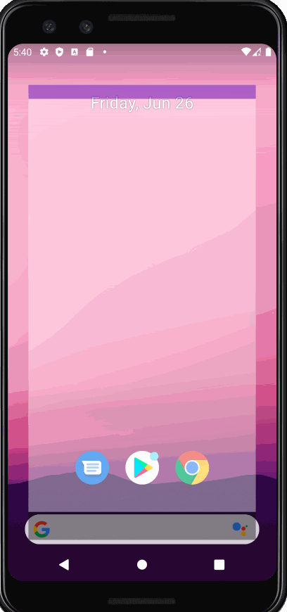
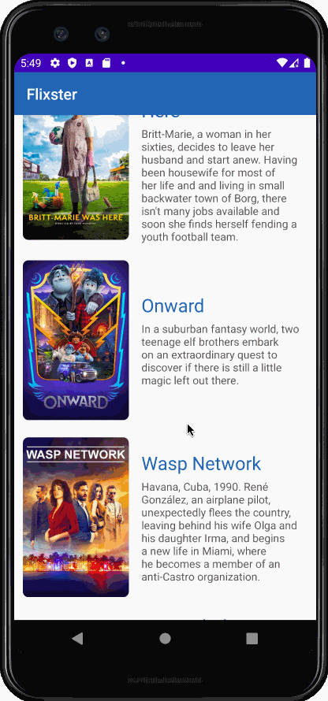

# Project 2 - *Flixster*

**Flixster** shows the latest movies currently playing in theaters. The app utilizes the Movie Database API to display images and basic information about these movies to the user.

Time spent: **15** hours spent in total

## User Stories

The following **required** functionality is completed:

* [x] User can **scroll through current movies** from the Movie Database API
* [x] Display a nice default [placeholder graphic](https://guides.codepath.org/android/Displaying-Images-with-the-Glide-Library#advanced-usage) for each image during loading
* [x] For each movie displayed, user can see the following details:
  * [x] Title, Poster Image, Overview (Portrait mode)
  * [x] Title, Backdrop Image, Overview (Landscape mode)
* [x] Allow user to view details of the movie including ratings and popularity within a separate activity

The following **stretch** features are implemented:

* [x] Improved the user interface by experimenting with styling and coloring. (somewhat)
* [x] Apply rounded corners for the poster or background images using [Glide transformations](https://guides.codepath.org/android/Displaying-Images-with-the-Glide-Library#transformations)
* [x] Apply the popular [View Binding annotation library](http://guides.codepath.org/android/Reducing-View-Boilerplate-with-ViewBinding) to reduce boilerplate code.
* [x] Allow video trailers to be played in full-screen using the YouTubePlayerView from the details screen.

The following **additional** features are implemented:

* [x] Scrolling on the details screen if the amount information displayed is bigger than the phone size. 
* [x] If there is no video trailer associated with a movie, a No Video Available image will be displayed. 

## Video Walkthrough

Here's a walkthrough of implemented user stories:

GIF created with [LiceCap](http://www.cockos.com/licecap/).

## Notes

The file with the YouTube and MoviesDB API keys, secrets.xml, is not included in this repo. 

Describe any challenges encountered while building the app.

* ImageView scaling may be slightly off - I'm not sure. 
* If you change orientations, the app will not remember the previous position you scrolled to and will display from the first movie. 
* Same thing with videos - if you pause the video and change orientations, the video will reload. 
* The placeholder image cannot be rounded/transformed by Glide.

## Open-source libraries used

- [Android Async HTTP](https://github.com/loopj/android-async-http) - Simple asynchronous HTTP requests with JSON parsing
- [Glide](https://github.com/bumptech/glide) - Image loading and caching library for Android

## License

    Copyright [2020] [Nina Tang]

    Licensed under the Apache License, Version 2.0 (the "License");
    you may not use this file except in compliance with the License.
    You may obtain a copy of the License at

        http://www.apache.org/licenses/LICENSE-2.0

    Unless required by applicable law or agreed to in writing, software
    distributed under the License is distributed on an "AS IS" BASIS,
    WITHOUT WARRANTIES OR CONDITIONS OF ANY KIND, either express or implied.
    See the License for the specific language governing permissions and
    limitations under the License.
